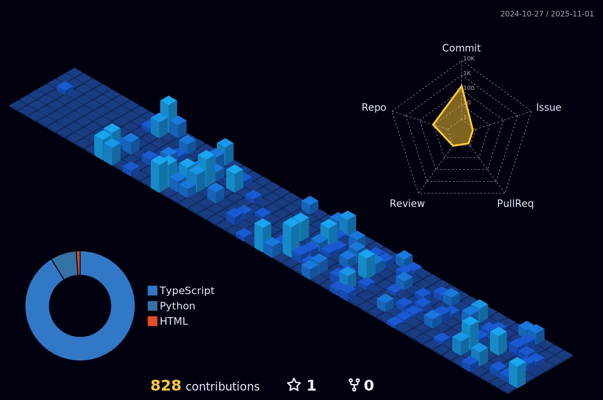

## Hello there! 👋

- 📚 Currently pursuing a degree in Systems Analysis and Development.
- 💡 Keen on exploring DevOps and other software development domains.
- 🚀 Enthusiastic about programming and always eager to tackle challenges that broaden my skill set.
- 💬 Feel free to hit me up for a chat anytime! 😄

  
  
 |  |  |  
 | ----------- | ----------- |

# Technologies I Use!
  

  

##

     
  

  
### Get in Touch!
  

  
  
  
  

